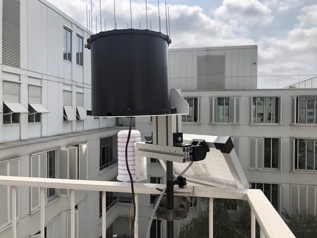
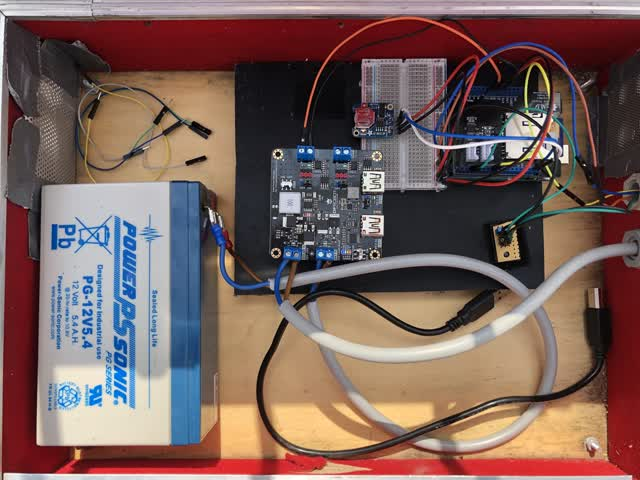

# MeteoLog II: an Autonomous NON connected Meteorologic Station using Arduino that records PRECIPITATION TIME

* [Introduction](##introduction)
* [Station](##station)
* [Arduino scripts](##arduino-scripts)
* [Python and SQL](##python-and-sql)


## Introduction <a class="anchor" id="introduction"></a>

The project aims at developping a lowcost meteorologic station with the following properties
* The station's main purpose is to measure rainfall but temperature and humidity are also included,
* it has to be solar powered,
* it has to store the data on an SD card
* it has to capture the time the pluviometer auget tilts and NOT the number of tilts during a given time period (what most if not all other pluviometers do).

If the last point is unimportant for you I suggest you use the Meteolog Project as it consumes less power.

Included are the references needed to build the station, the electronic and the codes needed to have it run.


## The station <a class="anchor" id="station"></a>



### Structure & parts

* Watchdog auger pluviometer that sends a small voltage when the auger tilts. The one I bought is uselessly expensive (400€) because  it includes an electronic logger that I do not wish to use here because (1) its time resolution is too limited, (2) it is not solar powered, (3) it has to be used with some silly expensive (100€) windows program to retrieve the data.
You can get the equivalent without the logger for ~ 100€ (Yeap..., look at Rainwise for exemple)
* Temperature and humidity sensor DHT11 (3.5€). A DHT22 (10.2€) would be better as it is more precise (0.5° and 2% compared to 2° and 5% for the DHT11).
* 10W SOL10P Solar panel (36.5€)
* 12V, 5.4Ah Lead battery (29€)
* DFRobot Sunflower 3.3/5/9/12 DFR0535 to handle the solar panel and the battery(32€),
* Housing for DHT11 by TFA Dostman (18€)
* Box for the electronic
* Rod and Norcan to hold everything

### Electronic




* Arduino Uno Rev 3
* RTC module to keep track of time
* The auger pluviometer is connected to the digital port 2 that enables interruptions to be raised. I add a capacitor to prevent false counts.
* SDcard module to store the data
* Solar charger connected to Lead battery and to the Uno.

## Arduino scripts <a class="anchor" id="arduino-scripts"></a>

### UnoMeteoLoggerNoSleep

This arduino is constantly awaken and reacts if an interrupt is raised by an auger tilt. In that case it records time. The arduino also stores Temparature and humidity every five minutes.

### RTCInitialize

this script set the time of the RTC clock. It has to be uploaded first, then you can upload the UnoMeteoLoggerNoSleep script.
Clock initialization has to be performed independantly. This prevents reinitialisation of the RTC each time the arduino restarts the UnoMeteoLoggerNoSleep script.


## Python and SQL <a class="anchor" id="python-and-sql"></a>

I use a Mariadb database to store the data once retrieved from the SDcard. I call the base weatherDB.
The table has three tables

a station table that records the information concerning the stations, a TH table where temperature and humidity is stored, and a P table where the time of tilt of the rainfall gage is recorded.


The structure tables is given below

### Stations
| Field| Type| description|
|---|---|---|
|stcode| varchar | station code|
|name| varchar | name of the station|
|longitude| float| geodetic|
|latitude|float | geodetic|
|elevation|float||
|comment|varchar| any comment|


### TH

| Field| Type| description|
|---|---|---|
|mdate| date| date of measurement|
|mtime| time| time of measurement|
|T| float| temperature|
|H| float| Humidity|
|stcode| varchar| station code|
|dcode| int| record code|

### P   
| Field| Type| description|
|---|---|---|
|pcode| int| record code|
|mdate| date| date of m  easurement|
|mtime| time| time of measurement|
|N| int| count normally 1|
|stcode| varchar| station code|

The stations table records the Station informations so it becomes possible to store the data from as many stations as we wish (once they're built !)

A sample of the database is given in data. To install the database you need to have a running version of MariaDB or Mysql server.

One way recreate the database is to open a terminal in the data folder and enter the following command
```mysql
mysql -u<your login> -p<your pass> < weatherDB.sql
```

 Once installed
enter your  your SQL identifiers  in the mylogin.txt file.
You can then run the demo scripts from Meteo.py
